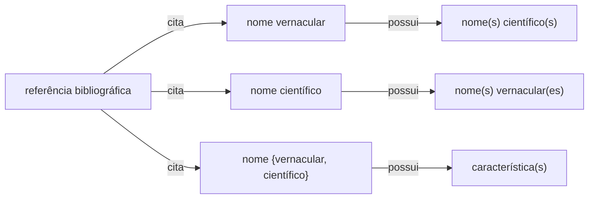

# Estrutura de Dados Etnobotânicos

Este repositório visa elaborar um protocolo e orientar a coleta e organização de dados etnobotânicos a partir de consultas a publicações, incluindo obras antigas, pesquisas e artigos com dados sobre usos de plantas e seus respectivos nomes vernáculos. O objetivo principal é registrar e sistematizar informações sobre o uso de plantas no Brasil, especialmente de períodos históricos importantes, abrangendo todos os tipos de usos descritos, incluindo usos medicinais, nutricionais, ritualísticos e casos de toxicidade.

## Sistematização dos dados oriundos de referências bibliográficas

Consideramos, para efeito desta proposta de padrão, que dados etnobotânicos presentes em referências bibliográficas podem ser classificados nas seguintes instâncias:

* a referência cita um nome científico associado a _n_ nomes vernaculares (p.ex. Martius)
* a referência cita um nome vernacular associado a _n_ nomes científicos
* a referência cita um nome {vernacular, científico} associado a _n_ caracteristicas de uso

Estes dados podem estar associados a outros atributos, como por exemplo a língua ou região do nome vernacular, ou a família botânica do nome científico. Entretanto, para efeito desta proposta de padrão, consideramos estas instâncias como "essenciais" (_core_) para a sistematização dos dados.
