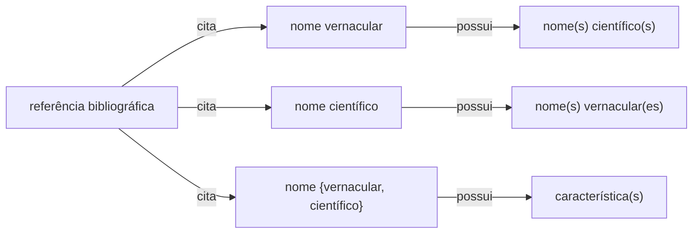

# Estrutura de Dados Etnobotânicos

Este repositório visa elaborar um protocolo e orientar a coleta e organização de dados etnobotânicos a partir de consultas a publicações, incluindo obras antigas, pesquisas e artigos com dados sobre usos de plantas e seus respectivos nomes vernáculos. O objetivo principal é registrar e sistematizar informações sobre o uso de plantas no Brasil, especialmente de períodos históricos importantes, abrangendo todos os tipos de usos descritos, incluindo usos medicinais, nutricionais, ritualísticos e casos de toxicidade.

## Sistematização dos dados oriundos de referências bibliográficas

### Estrutura de dados

Consideramos, para efeito desta proposta de padrão, que dados etnobotânicos presentes em referências bibliográficas podem ser classificados nas seguintes instâncias:

* a referência cita um nome científico associado a _n_ nomes vernaculares (p.ex. Martius)
* a referência cita um nome vernacular associado a _n_ nomes científicos
* a referência cita um nome {vernacular, científico} associado a _n_ caracteristicas de uso

Estes dados podem estar associados a outros atributos, como por exemplo a língua ou região do nome vernacular, ou a família botânica do nome científico. Entretanto, para efeito desta proposta de padrão, consideramos estas instâncias como "essenciais" (_core_) para a sistematização dos dados.

### Sistematização da relação _nome científico_ <-> _nome vernacular_

Para a sistematização desta instância, propomos a seguinte tabela:

| genus | specificEpithet | verbatimTaxonRank| infraspecificEpithet | scientificNameAuthorship | vernacularName | sourceAuthor | sourceYear | sourceTitle |
| --- | --- | --- | --- | --- | --- | --- | --- | --- |
| Abarma | cochiliacarpus | | | (Gomes) Barneby & J.W.Grimes | abarematemo | Martius | 2023 | Plantas usadas pelos brasileiros e suas substâncias  medicinais |
| Physalis | angulata | | | L. | camaru | Martius | 2023 | Plantas usadas pelos brasileiros e suas substâncias  medicinais |
| Physalis | pubescens | | | L. | camaru | Martius | 2023 | Plantas usadas pelos brasileiros e suas substâncias  medicinais |
| Urena | lobata | subsp. | sinuata | (L.) Borss.Waalk. | carrapicho | Martius | 2023 | Plantas usadas pelos brasileiros e suas substâncias  medicinais |

### Sistematização da relação _nome vernacular_ -> _característica_

| vernacularName | usedTo | useForm | usePart | propriety | source |
| --- | --- | --- | --- | --- | --- |
| abarematemo |  |  |  | antimicrobiana | SANTOS, P. A. L. dos .; SANTOS, L. C. dos .; COSTA, R. de A. .; ESTEVAM, A. dos S. .; SILVA, M. R. P. da .; REIS, I. A. de O. .; OLIVEIRA, J. S. de .; ARAUJO, B. S. de .; LUCCA JUNIOR, W. de .; SANTOS, S. B. dos .; ESTEVAM, C. dos S. . Chemical profile and antimicrobial activity of abarema cochliacarpos. Research, Society and Development, [S. l.], v. 11, n. 4, p. e22911427226, 2022. DOI: 10.33448/rsd-v11i4.27226. Disponível em: https://rsdjournal.org/index.php/rsd/article/view/27226. Acesso em: 6 jun. 2024. |
