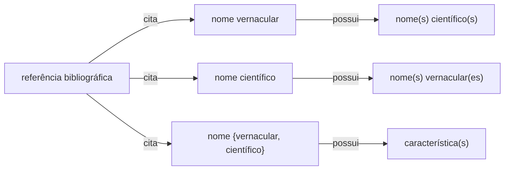

> :warning: **Warning:** Este projeto está na Versão 2.0 e em andamento. Ele procura integrar diferentes projetos e iniciativas que compartilham da mesma demanda por organização de dados sobre uso de plantas por comunidades tradicionais, a saber:

> * [Useflora](https://www.useflora.ufsc.br/) 
> * [Developing a Data Extension for Documenting Socio-Biodiversity Information](https://github.com/edalcin/cesp-sibbr-2024) 
> * [Empowering Indigenous Peoples and Local Communities (IPLCs) to manage biodiversity data and information as a strategy to conserve their territories, safeguard traditional knowledge, and promote integrated biodiversity management](https://www.thegef.org/projects-operations/projects/11269)
> * [Vocabulário Controlado em Etnobotânica (VCEB): Conectando Saberes](https://github.com/edalcin/etnovocab) 

# Estruturas e Padrões de Dados para Etnobotânica - ___EtnoData___ - Versão 2.0

## Motivação e Justificativa

Esforços de compilação de informações sobre plantas, sob a forma de dados estruturados em sistemas computacionais, fazem parte dos diversos estudos realizados por pesquisadores e estudantes de graduação e pós-graduação. Em relação a fonte dos dados e informações, podemos considerar dois tipos:

### Dados Primários

São informações coletadas diretamente pelo pesquisador no campo, através de contato direto com as comunidades estudadas. Incluem:

**Métodos de coleta:**
* Entrevistas estruturadas ou semi-estruturadas detentores do conhecimento tradicional
* Observação participante durante práticas de uso de plantas
* Caminhadas etnobotânicas com detentores locais
* Registros fotográficos e audiovisuais das práticas
* Coleta e herborização de espécimes botânicos citados

**Características:**
* Informações inéditas e contextualizadas
* Refletem o conhecimento atual da comunidade
* Permitem validação cruzada entre diferentes detentores
* Possibilitam aprofundamento em aspectos específicos

### Dados Secundários

São informações já publicadas ou documentadas pesquisadores, obtidas através de fontes existentes:

**Fontes principais:**
* Artigos científicos e teses sobre etnobotânica
* Livros e compêndios de plantas medicinais
* Relatórios técnicos e levantamentos anteriores
* Bases de dados etnobotânicos online
* Documentos históricos e registros etnográficos

**Características:**
* Informações já processadas e interpretadas
* Podem estar desatualizadas em relação às práticas atuais
* Úteis para comparações e contextualização histórica
* Permitem análises mais amplas e revisões sistemáticas

## Objetivo geral

Este repositório visa possibilitar a criação, de forma colaborativa e inclusiva, de um padrão para orientar a coleta e organização de dados e informações etnobotânicos __secundários__ a partir de consultas a publicações, incluindo obras antigas e artigos com dados sobre usos de plantas e seus respectivos nomes vernáculos. O objetivo principal é possibilitar o registro e sistematização, de forma padronizada, de informações sobre o uso de plantas no Brasil, especialmente de períodos históricos importantes, abrangendo todos os tipos de usos descritos, incluindo usos medicinais, nutricionais, ritualísticos e casos de toxicidade.

## Sistematização dos dados oriundos de referências bibliográficas

### Estrutura de dados

Consideramos, para efeito desta proposta de padrão, que dados etnobotânicos presentes em referências bibliográficas podem ser classificados nas seguintes instâncias:

* a referência cita um nome científico associado a _n_ nomes vernaculares (p.ex. Martius)
* a referência cita um nome vernacular associado a _n_ nomes científicos
* a referência cita um nome {vernacular, científico} associado a _n_ características de uso

Estes dados podem estar associados a outros atributos, como por exemplo a língua ou região do nome vernacular, ou a família botânica do nome científico. Entretanto, para efeito desta proposta de padrão, consideramos estas instâncias como "essenciais" (_core_) para a sistematização dos dados.

### Sistematização da relação _nome científico_ <-> _nome vernacular_

Para a sistematização desta instância, propomos a seguinte tabela: [tabela1.csv](https://github.com/luisaridolph/Estrutura-de-Dados-Etnobotanicos/blob/main/exemplos/tabela1.csv)

### Sistematização da relação _nome vernacular_ -> _característica_

Para a sistematização desta instância, propomos a seguinte tabela: [tabela2.csv](https://github.com/luisaridolph/Estrutura-de-Dados-Etnobotanicos/blob/main/exemplos/tabela2.csv)
