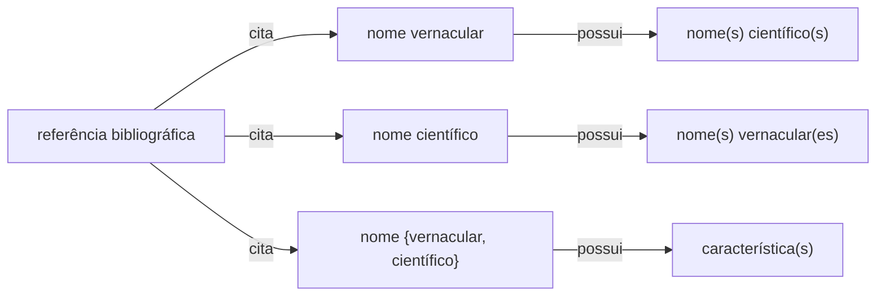

# Estruturas e Padrões de Dados para Etnobotânica - [EtnoData]

## Motivação e Justificativa

Esforços de compilação de informações sobre plantas, sob a forma de dados estruturados em sistemas computacionais fazem parte dos diversos estudos realizados por pesquisadores e estudantes de graduação e pós-graduação. Entretanto, os produtos gerados, em sua grande maioria, não seguem os princípios [FAIR](https://www.go-fair.org/fair-principles/) e [CARE](https://www.gida-global.org/care), fundamentais na gestão de dados desta natureza.

Em relação ao princípio de _interoperabilidade_, um dos quatro princípios FAIR, a falta de um padrão acordado para os metadados, classes, termos e dicionários para os dados dificulta sobremaneira a implementação plena dos princípios FAIR e CARE, em sua plenitude.

## Objetivo geral

Este repositório visa possibilitar a criação, de forma colaborativa e inclusiva, de um padrão para orientar a coleta e organização de dados etnobotânicos a partir de consultas a publicações, incluindo obras antigas e artigos com dados sobre usos de plantas e seus respectivos nomes vernáculos. O objetivo principal é possibilitar o registro e sistematização, de forma padronizada, de informações sobre o uso de plantas no Brasil, especialmente de períodos históricos importantes, abrangendo todos os tipos de usos descritos, incluindo usos medicinais, nutricionais, ritualísticos e casos de toxicidade.

Em um primeiro esforço, procuramos propor e validar um cojunto de dicionários para [categorias de uso](https://github.com/edalcin/Estrutura-de-Dados-Etnobotanicos/blob/main/dicionarios/useTo.md), [formas de uso](https://github.com/edalcin/Estrutura-de-Dados-Etnobotanicos/blob/main/dicionarios/useForm.md), [partes da planta](https://github.com/edalcin/Estrutura-de-Dados-Etnobotanicos/blob/main/dicionarios/useParts.md) e [propriedades](https://github.com/edalcin/Estrutura-de-Dados-Etnobotanicos/blob/main/dicionarios/proprieties.md).

## Sistematização dos dados oriundos de referências bibliográficas

### Estrutura de dados

Consideramos, para efeito desta proposta de padrão, que dados etnobotânicos presentes em referências bibliográficas podem ser classificados nas seguintes instâncias:

* a referência cita um nome científico associado a _n_ nomes vernaculares (p.ex. Martius)
* a referência cita um nome vernacular associado a _n_ nomes científicos
* a referência cita um nome {vernacular, científico} associado a _n_ características de uso

Estes dados podem estar associados a outros atributos, como por exemplo a língua ou região do nome vernacular, ou a família botânica do nome científico. Entretanto, para efeito desta proposta de padrão, consideramos estas instâncias como "essenciais" (_core_) para a sistematização dos dados.

### Sistematização da relação _nome científico_ <-> _nome vernacular_

Para a sistematização desta instância, propomos a seguinte tabela: [tabela1.csv](https://github.com/luisaridolph/Estrutura-de-Dados-Etnobotanicos/blob/main/exemplos/tabela1.csv)

### Sistematização da relação _nome vernacular_ -> _característica_

Para a sistematização desta instância, propomos a seguinte tabela: [tabela2.csv](https://github.com/luisaridolph/Estrutura-de-Dados-Etnobotanicos/blob/main/exemplos/tabela2.csv)
