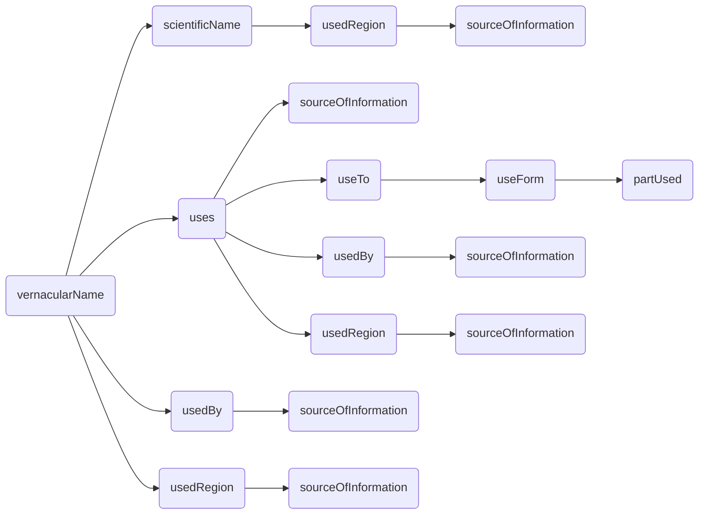

```mermaid
graph LR
    A(vernacularName) --> B(uses)
    A --> C(scientificName)
    C --> Q(usedRegion)
    B --> D(sourceOfInformation)
    Q --> E(sourceOfInformation)
    B --> F(useTo)
    F --> G(useForm)
    G --> H(partUsed)
    B --> I(usedBy)
    I --> J(sourceOfInformation)
    B --> K(usedRegion)
    K --> L(sourceOfInformation)

    A --> M(usedBy)
    M --> N(sourceOfInformation)
    A --> O(usedRegion)
    O --> P(sourceOfInformation)
```
